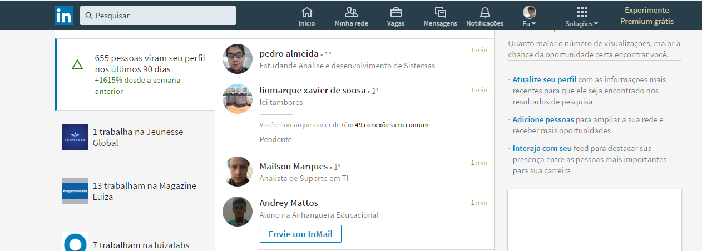
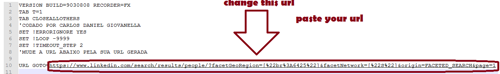

# LinkedIn BOT V2


## Requirements
 - Firefox Mozilla 47 (download link: https://releases.mozilla.org/pub/firefox/releases/48.0.2/win32/pt-BR/) (newer options dont work)
 - Python 3.4+ (optional)
 - iMacros installed on Mozilla (download link: https://addons.mozilla.org/pt-br/firefox/addon/imacros-for-firefox/)
 
## VERSION 2 [BETA] Configuration
(Login in your LinkedIn account in Mozilla Firefox)

1 - Move the file MacroLinkedinV2.iim to C:\Users\ YOUR USER \Documents\iMacros\Macros

2 - Open Firefox 47

3 - Open iMacros

4 - You will see MacroLinkedinV2.iim, right click, "Add to Bookmark / Adicionar aos favoritos"

5 - Click in OK

6 - Access https://www.linkedin.com/search/results/people/

7 - Select 2° and 3°+ (In filter people)

8 - Unmark 1° Connections Option

9 - Select the citys that you want it to works. (For example, if you only want from your city, just select your city)

10 - CTRL-C in the URL

11 - Open MacroLinkedinV2.iim with some text-editor

12 - Change the commented area for your url (see photo below)


```
py BotdoLinkedin.py --v2
or
python BotdoLinkedin.py --v2
```
## Configuration V1
### Automatic Way (With Python)
(Download all files)

1 - Move the file MacroLinkedin.iim to C:\Users\ YOUR USER \Documents\iMacros\Macros 

2 - Open Firefox 47

3 - Open iMacros

4 - You will see MacroLinkedin.iim, right click, "Add to Bookmark / Adicionar aos favoritos"

5 - Click in OK

6 - Access https://www.linkedin.com/mynetwork/

7 - Login in your account

8 - Close Firefox

```py BotdoLinkedin.py --v1
or
python BotdoLinkedin.py --v1
```
### Manually Way (Without Python)
(Download all files) (Maybe not work without python calling the params, because this uses !loop -9999. Use if python, if you have installed it on computer.)

1 - Move the file MacroLinkedin.iim to C:\Users\Computador\Documents\iMacros\Macros

2 - Open Firefox 47

3 - Open iMacros

4 - Access https://www.linkedin.com/mynetwork/ and login in your linkedin account

5 - Click in MacroLinkedin.iim, and then "USE"


### Issues
This is on beta test, any issue or problem, tell me with github issues options. Thanks.

Known issue: Sometimes it will appear always the same friends. Just clean the cache, logout and login again and it will works.

### Liability
I don't take no liability for the usage of this. At LinkedIn terms, they say that's prohibited the use of BOTS. I think you are not going to get problems, because the macro recuse some requests, and accept some others, wait 1.5 seconds for clicking in add friend, and refresh like 3 or 4 times (Made for getting friends at normal-human speed). But I give no guarantee that you won't get some 24 to 48 hours block, or any bigger problem. Careful usage, please!

#### *Plot Twist*
You can use the version 1 with the version 2 in the same time. It will  get you LIKELY 10.000 friends in 1 day (average calculating the media 100/hour with v1, and 300/hour with v2)

Just open one CMD/Terminal in sandbox or virtual machine, and another as common user (or use 2 computers)
